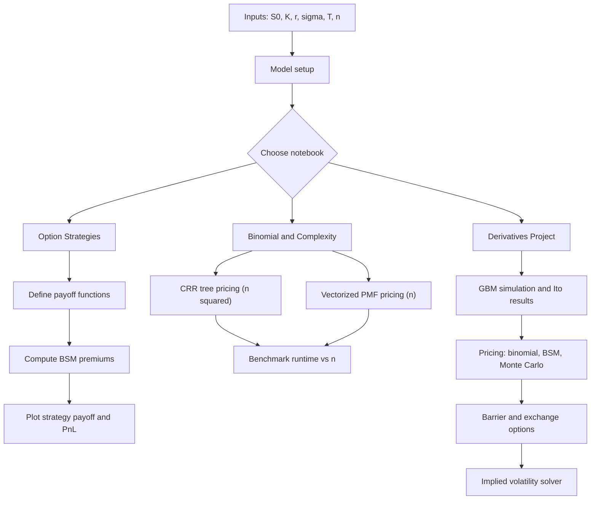

This repo contains three Jupyter notebooks covering **option pricing**, **option strategies**, **binomial/Monte‑Carlo methods**, and a **time‑complexity comparison** of pricing algorithms.

## Contents

- [`Option Strategies NCCU.ipynb`](./Option%20Strategies%20NCCU.ipynb)  
  Black‑Scholes‑Merton (BSM) pricing + payoff / P&L diagrams for common option strategies.

- [`BonusAlgoComplexity_111303017.ipynb`](./BonusAlgoComplexity_111303017.ipynb)  
  “Generalized binomial” European call pricing + benchmarking **CRR tree** vs **vectorized binomial‑PMF**.

- [`Derivatives_Group11_Projects.ipynb`](./Derivatives_Group11_Projects.ipynb)  
  Course group project: GBM simulation, Itô results, binomial convergence, spreads, Monte‑Carlo pricing (barrier / exchange options), and implied volatility.

---

## Quickstart

### 1) Create an environment (recommended)

```bash
python -m venv .venv
source .venv/bin/activate   # macOS/Linux
# .venv\Scripts\activate    # Windows
```

### 2) Install dependencies

```bash
pip install numpy pandas scipy matplotlib jupyter
```

### 3) Run notebooks

```bash
jupyter lab
```

---

## High-level flow




## Notes on reproducibility

- Some sections set a fixed random seed (e.g., `np.random.seed(5)`).
- Monte Carlo prices depend on: number of sims \(N\), time discretization, and barrier monitoring frequency.

---

## License

If this is coursework, keep it private unless your instructor allows public sharing.
"""
Path("/mnt/data/README.md").write_text(readme, encoding="utf-8")
"/mnt/data/README.md"

