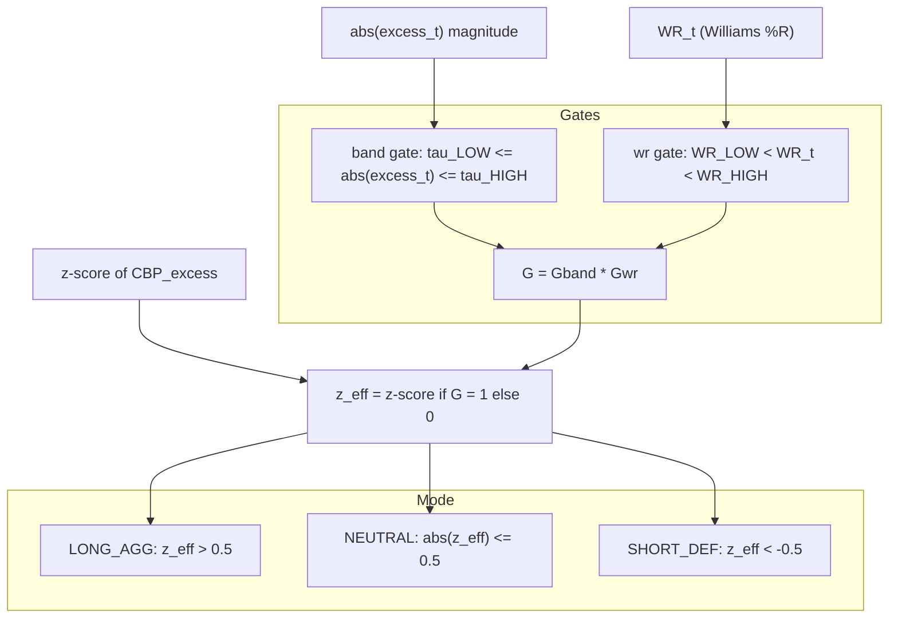

```mermaid
flowchart TB
  X["abs(excess_t) magnitude"]
  WR["WR_t (Williams %R)"]
  Z["z-score of CBP_excess"]

  subgraph Gates
    Gband["band gate: tau_LOW <= abs(excess_t) <= tau_HIGH"]
    Gwr["wr gate: WR_LOW < WR_t < WR_HIGH"]
    G["G = Gband * Gwr"]
  end

  Zeff["z_eff = z-score if G = 1 else 0"]

  subgraph Mode
    Long["LONG_AGG: z_eff > 0.5"]
    Neutral["NEUTRAL: abs(z_eff) <= 0.5"]
    Short["SHORT_DEF: z_eff < -0.5"]
  end

  X --> Gband
  WR --> Gwr
  Z --> Zeff
  Gband --> G
  Gwr --> G
  G --> Zeff
  Zeff --> Long
  Zeff --> Neutral
  Zeff --> Short
```
