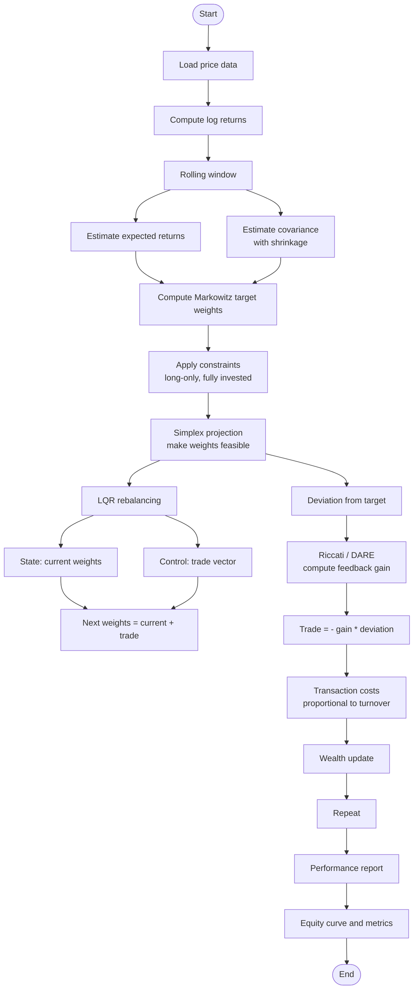

# Personal Research

```mermaid
flowchart TD
  A([Start]) --> B[Load price data]
  B --> C[Compute log returns]
  C --> D[Rolling window]

  D --> E[Estimate expected returns]
  D --> F[Estimate covariance\nwith shrinkage]

  E --> G[Compute Markowitz target weights]
  F --> G

  G --> H[Apply constraints\nlong-only, fully invested]
  H --> I[Simplex projection\nmake weights feasible]

  I --> J[LQR rebalancing]
  J --> K[State: current weights]
  J --> L[Control: trade vector]

  K --> M[Next weights = current + trade]
  L --> M

  I --> N[Deviation from target]
  N --> O[Riccati / DARE\ncompute feedback gain]
  O --> P[Trade = - gain * deviation]

  P --> Q[Transaction costs\nproportional to turnover]
  Q --> R[Wealth update]
  R --> S[Repeat]

  S --> T[Performance report]
  T --> U[Equity curve and metrics]
  U --> V([End])
```
